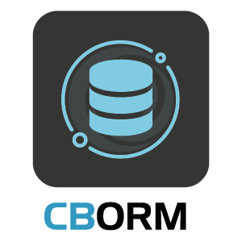

# Welcome To The ColdBox ORM Module

[](https://github.com/coldbox-modules/cborm/actions/workflows/ci.yml)


This module will enhance your experience when working with the ColdFusion (CFML) ORM powered by Hibernate.  It will not only enhance it with dynamic goodness but give you a fluent and human approach to working with Hibernate.  It will finally make working with ORM NOT SUCK!

## Features

* Service Layers with all the methods you could probably think off to help you get started in any project
* Virtual service layers so you can create virtual services for any entity in your application
* ActiveEntity our implementation of Active Record for ORM
* Fluent queries via Hibernate's criteria and detached criteria queries with some Dynamic CFML goodness
* Dynamic finders and counters
* Entity population from json, structs, xml, and queryies including building up their relationships
* Entity validation
* Includes the [Mementifier project](https://www.forgebox.io/view/mementifier) to produce memento states from any entity, great for producing JSON
* Ability for finders and queries to be returned as Java streams using our [cbStreams](https://www.forgebox.io/view/cbstreams) project.
* Automatic REST CRUD, stop wasting time building resources and just leverage our base resource: https://coldbox-orm.ortusbooks.com/orm-events/automatic-rest-crud

```js
# A quick preview of some functionality

var book = new Book().findByTitle( "My Awesome Book" );
var book = new Book().getOrFail( 2 );

property name="userService" inject="entityService:User";

return userService.list();
return userService.list( asStream=true );

userService
	.newCriteria()
	.eq( "name", "luis" )
	.isTrue( "isActive" )
	.getOrFail();

userService
	.newCriteria()
	.isTrue( "isActive" )
	.joinTo( "role" )
		.eq( "name", "admin" )
	.asStream()
	.list();

userService
	.newCriteria()
	.withProjections( property="id,fname:firstName,lname:lastName,age" )
	.isTrue( "isActive" )
	.joinTo( "role" )
		.eq( "name", "admin" )
	.asStruct()
	.list();
```

### In other words, it makes using an ORM not SUCK! :rocket:

## LICENSE

Apache License, Version 2.0.

## IMPORTANT LINKS

**Source & Changelog**

* https://github.com/coldbox-modules/cborm
* [Changelog](changelog.md)

**Documentation**

* https://coldbox-orm.ortusbooks.com/

**Issues**

* https://ortussolutions.atlassian.net/browse/CBORM

**Support**

* https://community.ortussolutions.com/c/box-modules/cborm/25

## SYSTEM REQUIREMENTS

* Lucee 5+
  * Hibernate 3.5.x
  * Hibernate 5.x via the new hibernate extension
* ColdFusion 2018
  * Hibernate 5.2.11
* ColdFusion 2021
  * Hibernate 5.2.11

# INSTRUCTIONS

Use CommandBox cli to install:

```bash
box install cborm
```

Unfortunately, due to the way that ORM is loaded by ColdFusion, if you are using the ORM EventHandler or `ActiveEntity` or any ColdBox Proxies that require ORM, you must create an Application Mapping in the `Application.cfc` like this:

```js
this.mappings[ "/cborm" ] = COLDBOX_APP_ROOT_PATH & "modules/cborm";
```

This is due to the fact that the ORM event listener starts before ColdBox, so no dynamic mappings exist yet.  **Important**: Make sure you ALWAYS lazy load dependencies in your event handlers to avoid chicken and the egg issues.

## WireBox DSL

The module also registers a new WireBox DSL called `entityservice` which can produce virtual or base ORM entity services:

* `entityservice` -  Inject a global ORM service so you can work with ANY entity
* `entityservice:{entityName}` - Inject a Virtual entity service according to `entityName`

## Settings

Here are the module settings you can place in your `config/Coldbox.cfc` under the `moduleSettings.cborm` structure:

```js
moduleSettings = {
	cborm = {
		// Resource Settings
		resources : {
			// Enable the ORM Resource Event Loader
			eventLoader  : false,
			// Prefix to use on all the registered pre/post{Entity}{Action} events
			eventPrefix : "",
			// Pagination max rows
			maxRows      : 25,
			// Pagination max row limit: 0 = no limit
			maxRowsLimit : 500
		},
		// WireBox Injection Bridge
		injection : {
			enabled : true,
			include : "",
			exclude : ""
		}
	}
};
```

## Validation

We have also migrated the `UniqueValidator` from the **validation** module into our
ORM module.  It is mapped into wirebox as `UniqueValidator@cborm` so you can use in your constraints like so:

```js
this.constraints = {
    "name"  : {
              "required":true,
              "validator":"UniqueValidator@cborm"
            }
};
```

## Contributing

All contributions welcome! Feel free to fix a typo, add a feature :rocket:, or add a testbox spec for a newly discovered issue :bug:

If you want to get hacking on CBORM, here's how to start:

1. Make sure you have CommandBox installed: https://www.ortussolutions.com/products/commandbox#download
2. Star, Fork, and Clone down this repo: https://github.com/coldbox-modules/cborm
3. Start a MySQL 5+ service or you can use our `docker-compose.yml` file. Just make sure you have Docker installed. `run-script startdbs` or run it manually below.

```bash
docker run \
    -e MYSQL_RANDOM_ROOT_PASSWORD=yes \
    -e MYSQL_USER=other \
    -e MYSQL_PASSWORD=ortussolutions \
    -e MYSQL_DATABASE=coolblog \
    -v "$PWD/test-harness/tests/resources":/docker-entrypoint-initdb.d \
    -p 3306:3306 \
    --detach \
    --name cborm_mysql \
    mysql
```

3. Copy `.env.template` to `.env` and enter the database credentials used in step 2 above ☝
4. Install the project dependencies with CommandBox `box run-script install:dependencies`
5. Start a test server - `box start server-lucee@5.json` (You can use adobe or other engines)
6. Hack away! :laptop:

********************************************************************************
Copyright Since 2005 ColdBox Framework by Luis Majano and Ortus Solutions, Corp
www.ortussolutions.com
********************************************************************************

### HONOR GOES TO GOD ABOVE ALL

Because of His grace, this project exists. If you don't like this, then don't read it, its not for you.

> "Therefore being justified by faith, we have peace with God through our Lord Jesus Christ:
By whom also we have access by faith into this grace wherein we stand, and rejoice in hope of the glory of God.
And not only so, but we glory in tribulations also: knowing that tribulation worketh patience;
And patience, experience; and experience, hope:
And hope maketh not ashamed; because the love of God is shed abroad in our hearts by the
Holy Ghost which is given unto us. ." Romans 5:5

### THE DAILY BREAD

 > "I am the way, and the truth, and the life; no one comes to the Father, but by me (JESUS)" Jn 14:1-12
